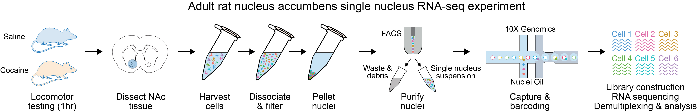
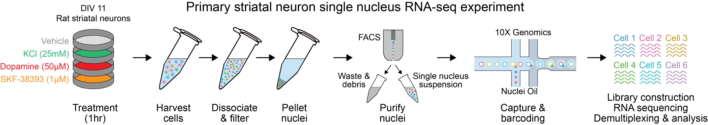
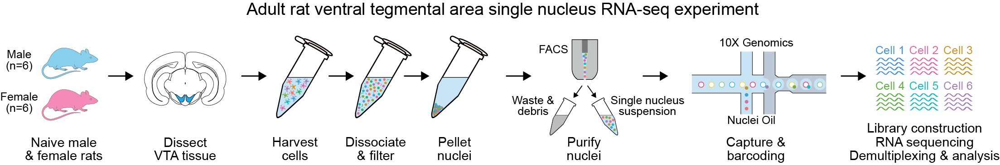

# The Ratlas datasets

The Ratlas single-nucleus RNA-seq (snRNA-seq) datasets are currently composed of the following:

__1) The rat nucleus accumbens (NAc), with samples taken from four experimental groups:__

* Male adult rats, 1hr following saline injection
* Male adult rats, 1hr following cocaine injection (20mg/kg, I.P.)
* Female adult rats, 1hr following saline injection
* Female adult rats, 1hr following cocaine injection (20mg/kg, I.P.)
 
 

 

__2) Primary striatal neurons (mixed from male and female E18 rat brains and cultured to DIV11) from four experimental groups:__

* Vehicle (media alone, 1hr)
* Dopamine (50µM, 1hr)
* SKF-38393 (1µM, 1hr)
* Potassium chloride (25mM, 1hr)
 
 

 

__3) Adult rat ventral tegmental area (VTA) from naive male and female rats.__

 

 

----
### Citation:

Katherine E. Savell\*, Jennifer J. Tuscher\*, Morgan E. Zipperly\*, Corey G. Duke\*, Robert A.Phillips III\*, Allison J. Bauman, Saakshi Thukral, Faraz A. Sultan, Nicholas A. Goska, Lara Ianov, Jeremy J. Day (Science Advances, June, 2020). [_A dopamine-induced gene expression signature regulates neuronal function and cocaine response_](https://advances.sciencemag.org/content/6/26/eaba4221) DOI: 10.1126/sciadv.aba4221

Phillips III, R.A.\* Tuscher, J.J.\*, Black, S.L., Andraka E., Fitzgerald, N.D., Ianov, L., & Day, J.J. (Cell Reports, April, 2022). [_An atlas of transcriptionally defined cell populations in the rat ventral tegmental area._](https://www.cell.com/cell-reports/fulltext/S2211-1247%2822%2900364-3) DOI: <https://doi.org/10.1016/j.celrep.2022.110616>

### Links:

Direct link to analytical code for the work cited above (including VTA Dockerfiles) can be found at <https://github.com/Jeremy-Day-Lab>

All Day lab resources may be found at the [Day Lab website](http://day-lab.org/resources)

### FAQ:

1. Why can't I find my gene?

	Users of the app should be aware of the feature to search by gene IDs for cases when a gene name is not assigned during the generation of the cell matrices (gene ids are typically associated with more novel genes in the rat assembly. You will normally find either a gene name or ID, not both). Please see the "Gene name search" help icon at the upper right corner of the `Choose a gene` option for more information including reference genome source and versions. We add special emphasis on this section since the addition of the rn7 mapping.

### About the app:

This app was developed and is actively maintained by Lara Ianov, Ph.D., Managing Director of the [UAB Biological Data Science Core](https://www.uab.edu/cores/ircp/bds), and bioinformatics specialist for the Civitan International Research Center, at the University of Alabama at Birmingham. For questions about the app, please send an to lianov@uab.edu
